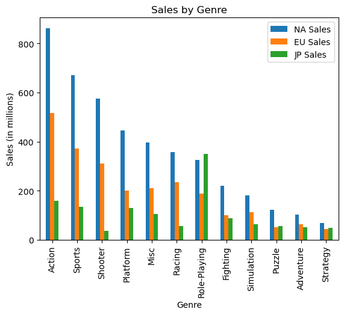
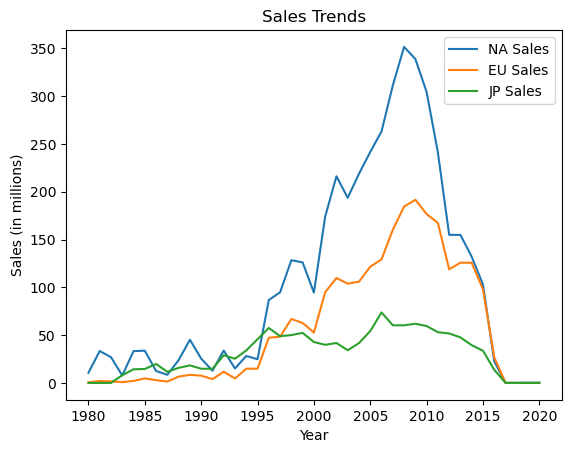
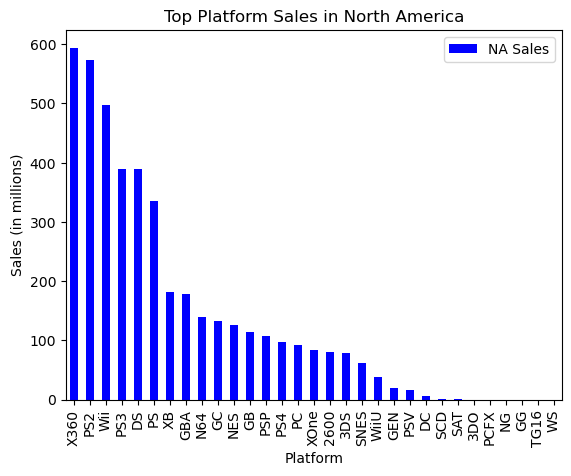
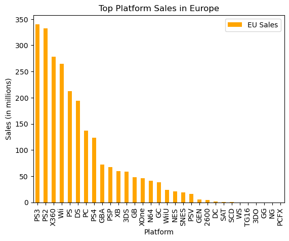
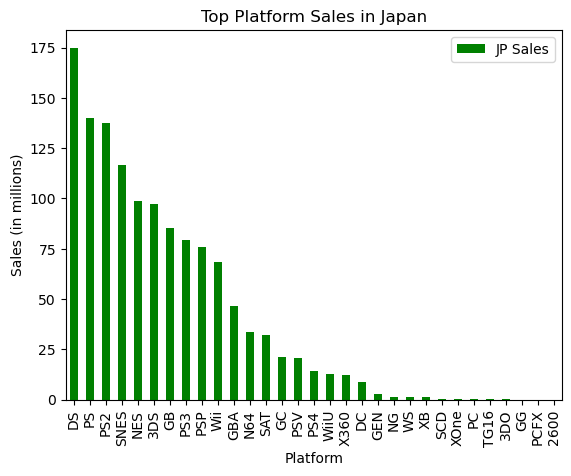
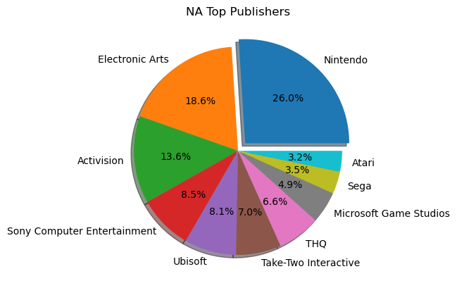
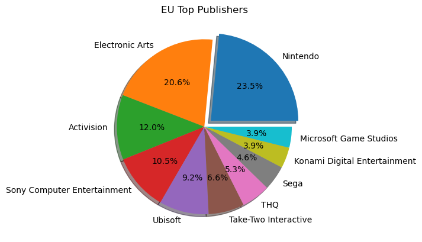
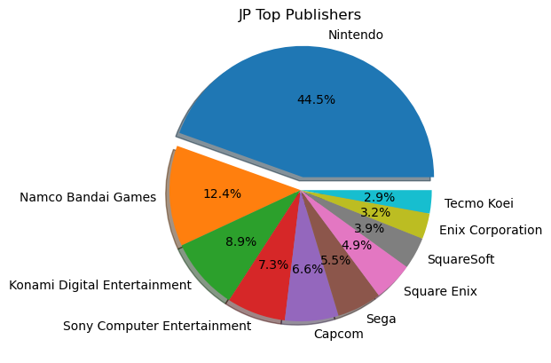

# Project-One

# Project Title: Global Video Games Sales 

# Team Members: 
A'Nayah, Ivan, Brittney, Iman

# Project Description: 

1.Import,read, and display csv file.
2.Clean data from any null values.
3.Make columns more legible.
4.Identify the top sales per region and create a visual.
5.Get the trend of sales over the years per region and create a line graph.
6.Find the most popular platforms per region and plot them in a bar graph.
7. Find the top publishers per region and create pie chart for visualization.
8.Save all images to ipynb file

Presentation:
    1. Create slides using visulatizations
    2. Summarize the final analysis
    
# Research Questions to Answer:
    1. What genre of games are the most preferred in each region?
    2. How has the sales changed over the years per region?
    3. If I wanted to create a game in each region, which platform should I use? 
    4. Who are the top ten publishers per region?

# Dataset To Be Used:

    "https://www.kaggle.com/datasets/thedevastator/global-video-game-sales?resource=download"

# Rough Breakdown Of Tasks:
    Data Cleaning
    Data Visualization 
    Written Analysis
    Presentation

# Analysis
    1. What genre of games are the most preferred in each region?
     - Based on the provided data on video games, we conclude the top sales by genre for North America and Europe are action, sports, and shooter. For Japan, the         top three sales based on genre are role-playing, action, and sports.
     
     

    
    
    2. How has the sales changed over the years per region?
    
    - The highest profitable sales peak were between the years 2005 through 2010 for all three regions. Shortly after the sales decreased drastically, we predict        it is because of the new way of getting games digitally and access to more used games.
    

    
    
    3. If I wanted to create a game in each region, which platform should I use? 
    
    - We conclude if a game is produced, for the NA Region, the top three platforms are X360, PS2, and Wii. For the EU region, it's PS3,PS2,X360. For the JP             region, the top three are DS,PS,PS2.

    
    4. Who are the top ten publishers per region?
    
    - The top publisher for all three regions is Nintendo. 
    - However, the following top publishers for the NA Region are Electronic Arts, Activision, Sony, Ubisoft, Take_two, THQ, Microsoft,Sega,Atari.
    - For the EU Region: Electronic Arts, Activision, Sony, Ubisoftm Take-Two, THQ, Sega, Konami Digital, Microsoft.
    - For the JP Region: Namaco Bandai, Konami Digital, Sony, Capcom, Sega, Square Enix, SquareSoft, Enix, Tecmo Koei. 

# Conclusion

In conclusion, if you want to sell a game in  North America or Europe, it is best to cater to the Action genre for any major consoles. Whereas in Japan, a game catered to Role-playing would be ideal. In selection of a platform, X360 or any version of the PS, would be most profitable  across all three regions. Nintendo is the highest selling publisher across all three regions, more so in Japan, however Electronic Arts is also a beneficial publisher in the North American and European regions. 

